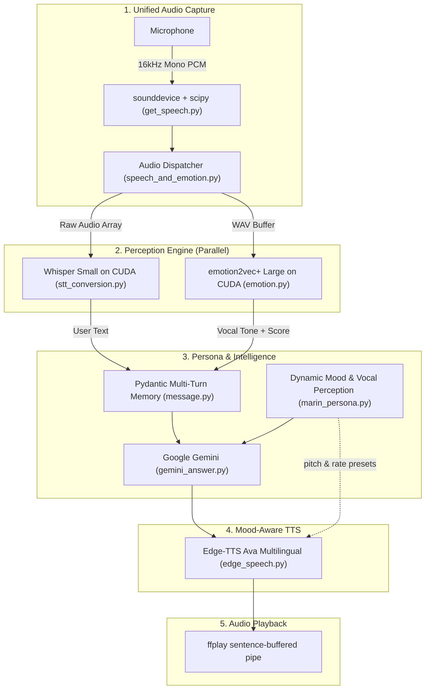
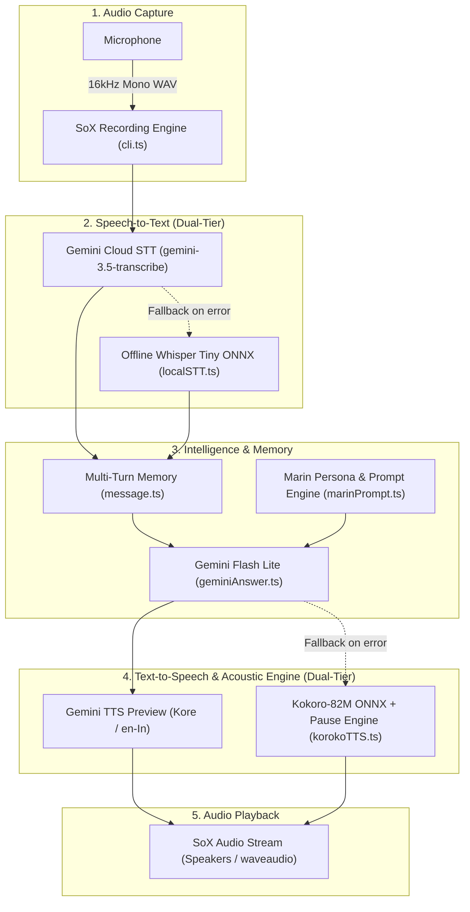

# Marin

An AI girlfriend.

Currently in development...

---

**Marin** is an interactive, voice-first AI girlfriend designed for natural, real-time spoken conversations. Unlike traditional virtual assistants or rigid chatbots, Marin is built to converse like a real companion—delivering spontaneous reactions, playful banter, genuine emotional nuance, and human-like conversational cadence directly through your microphone and speakers.

Marin features a **dynamic mood engine** that shifts her personality each call—clingy, teasing, grumpy, hyper, or quietly affectionate—with voice pitch and pacing that adapt to match. Backed by a dual-engine architecture across both Python and TypeScript, Marin pairs Google's Gemini models with expressive cloud speech synthesis (Edge-TTS), local Speech Emotion Recognition (`emotion2vec`), and multi-turn context memory to make every conversation feel continuous, intimate, and alive.

> **Work in Progress** — Marin is under active development. Features, voices, and architecture may change between updates. Contributions and feedback are welcome!

---

## Features

### 1. Python CLI Voice Pipeline (Primary)

An end-to-end voice companion pipeline in Python powered by `uv`. It captures speech from your microphone, transcribes it locally using Whisper on CUDA, detects your vocal emotion using `emotion2vec_plus_large`, queries Google Gemini for emotionally nuanced conversational responses that react to how you sound, and synthesizes expressive speech back to you through Edge-TTS with mood-matched voice tuning.

#### Pipeline Architecture

1. **Microphone Recording (`src/speech_recognition/get_speech.py`)**:
   - Uses `sounddevice` and `scipy.io.wavfile` to capture 16,000 Hz mono PCM audio directly from your microphone.
   - Starts recording on launch and trims audio automatically when the user presses `Enter`.
   - Converts the audio in-memory to WAV buffers without temporary file overhead on disk.

2. **Unified Audio Dispatcher (`src/speech_and_emotion/speech_and_emotion.py`)**:
   - Captures speech once from the microphone and dispatches the exact same audio buffer in parallel to both Speech-to-Text and Speech Emotion Recognition.
   - Eliminates redundant recordings and synchronizes transcription with vocal emotion.

3. **Speech-to-Text (`src/speech_to_text/stt_conversion.py`)**:
   - High-accuracy local speech transcription powered by Hugging Face `transformers` pipeline (`openai/whisper-small.en`).
   - Runs directly on GPU with CUDA acceleration (`device="cuda"`), completely offline without third-party STT fees or latency.

4. **Speech Emotion Recognition (`src/speech_recognition/emotion.py`)**:
   - Powered by FunASR's `iic/emotion2vec_plus_large` foundation model on CUDA.
   - Evaluates acoustic pitch, tone, energy, and speech rate to classify vocal emotion (angry, happy, sad, neutral, surprised, fearful, disgusted) with ranked probability scores.
   - Silenced internal logging and disabled remote polling for instant offline inference.

5. **Dynamic Persona & Mood Engine (`src/llm/marin_persona.py`)**:
   - Powers Marin's evolving personality with a pool of moods: *clingy, drained, hyper, grumpy, mischievous, distracted, soft, restless.*
   - Each call randomly selects a mood, and the system prompt adapts Marin's tone, quirks, and conversational style accordingly.
   - **Vocal Tone Perception**: Listens and reacts naturally to the boyfriend's vocal tone (softens when he sounds sad or drained, matches energy when angry or frustrated, teases when excited).
   - Voice texturing designed specifically for text-to-speech, banning robotic text sounds (`pfff`, `ugh`, `ugug`) in favor of natural conversational vocalizations (`uuuffff`, `ohhhh`, `okayyyy`).
   - Time-of-day awareness (morning, afternoon, evening, late night) adds contextual realism.

6. **Conversational Intelligence (`src/llm/gemini_answer.py`)**:
   - Queries Google Gemini (`gemini-3.5-flash-lite`) with the dynamically generated persona prompt from `marin_persona.py`.
   - **Multi-Turn Context Memory (`src/validation/message.py`)**: Strict Pydantic-validated `Message` model (`role`, `text`, `emotion_type`, `emotion_score`) preserving continuous chat history and tone tracking across turns.
   - **Voice Exit Commands**: Built-in voice commands (`"bye"`, `"quit"`, `"exit"`) allow you to end the call naturally.

7. **Text-to-Speech & Acoustic Playback (`src/text_to_speech/edge_speech.py`)**:
   - Sentence-pipelined Microsoft Edge TTS (`edge-tts`) using the `en-US-AvaMultilingualNeural` voice.
   - Mood-aware pitch and rate adjustments (e.g., higher pitch when hyper, softer when sleepy) via `MOOD_VOICE_PRESETS`.
   - Buffers full sentences in memory before piping to `ffplay` for stutter-free playback.
   - Supports barge-in (interruption) to cancel speech mid-stream.



---

### 2. TypeScript / Bun CLI Voice Pipeline

A parallel TypeScript implementation featuring dual-tier local and cloud models with an acoustic micro-pause engine.

#### Pipeline Architecture

1. **Microphone Recording (`src/cli.ts`)**:
   - Uses SoX (`sox` / `sox.exe`) with cross-platform OS detection (native Windows `waveaudio` support).
   - Records 16-bit 16,000 Hz mono WAV audio directly from the microphone until the user presses `Enter`.

2. **Speech-to-Text (`src/geminiSTT.ts` & `src/localSTT.ts`)**:
   - **Primary (Cloud)**: Streams the audio buffer to Google Gemini (`gemini-3.5-transcribe`).
   - **Fallback (Local / Offline)**: Offline Whisper Tiny model (`onnx-community/whisper-tiny.en` via `@huggingface/transformers`).

3. **Conversational Intelligence (`src/geminiAnswer.ts` & `src/marinPrompt.ts`)**:
   - Prompts Google Gemini (`gemini-3.1-flash-lite` / `gemini-3.5-flash-lite`) with Marin's girlfriend persona and multi-turn context memory (`src/message.ts`).

4. **Text-to-Speech & Acoustic Engine (`src/geminiTTS.ts` & `src/korokoTTS.ts`)**:
   - **Primary (Cloud TTS)**: Gemini Text-to-Speech preview (`gemini-3.1-flash-tts-preview`, `Kore` voice).
   - **Fallback (Local Kokoro ONNX)**: `kokoro-js` with a custom speech parser (`parseSpeech`) supporting asynchronous micro-pauses (`[pause:ms]`).



---

### 3. Browser Speech-to-Text (STT)

A TypeScript speech-to-text implementation using the browser's native Web Speech API (`SpeechRecognition`). 

No UI, no buttons, no CSS—just pure browser console logs.

#### How It Works

- Uses browser native `SpeechRecognition` / `webkitSpeechRecognition`.
- Continuous listening (`recognition.continuous = true`).
- Live **interim** transcripts and locked-in **final** transcripts logged directly to the browser console and sent to `/generate-audio`.

#### Usage

1. Start the local server:
   ```bash
   bun run server.ts
   ```
2. Open `http://localhost:3000` (or `index.html`) in a supported browser (Chrome, Edge).
3. Open the browser developer console (`F12`) to view live logs.
4. Allow microphone access and start speaking.

---

## File Structure

```
marin/
├── pyproject.toml                     # Python configuration (uv, CUDA PyTorch, FunASR, dependencies)
├── uv.lock                            # Locked Python dependency tree
├── package.json                       # TypeScript project metadata and dependencies
├── tsconfig.json                      # TypeScript configuration
├── src/
│   ├── app.py                         # Main Python voice loop with mood & emotion intelligence
│   ├── speech_and_emotion/
│   │   └── speech_and_emotion.py      # Unified audio capture dispatcher (STT + emotion2vec)
│   ├── speech_recognition/
│   │   ├── get_speech.py              # sounddevice microphone capture & in-memory WAV buffer
│   │   ├── emotion.py                 # FunASR emotion2vec_plus_large on CUDA
│   │   └── speech_emotion_detect.py   # Standalone emotion detection testing script
│   ├── speech_to_text/
│   │   └── stt_conversion.py          # Hugging Face Whisper-Small STT on CUDA
│   ├── llm/
│   │   ├── gemini_answer.py           # Google Gemini conversational engine with tone tagging
│   │   ├── llm_prompt.py              # Legacy static persona prompt (reference)
│   │   └── marin_persona.py           # Dynamic mood engine, vocal tone perception & voice presets
│   ├── text_to_speech/
│   │   └── edge_speech.py             # Edge-TTS with sentence pipelining, barge-in & mood presets
│   ├── validation/
│   │   └── message.py                 # Pydantic Message schema with emotion metadata and history
│   ├── main.ts                        # TypeScript continuous CLI conversational voice loop
│   ├── cli.ts                         # SoX-based microphone recording (16kHz mono WAV)
│   ├── geminiAnswer.ts                # TypeScript Gemini response generator
│   ├── geminiSTT.ts                   # Primary Cloud STT via Gemini 3.5 Transcribe
│   ├── geminiTTS.ts                   # Primary Cloud TTS via Gemini Flash TTS (Kore voice)
│   ├── korokoTTS.ts                   # TypeScript Kokoro-82M ONNX TTS with pause parser
│   ├── localSTT.ts                    # TypeScript offline fallback STT via ONNX Whisper Tiny
│   ├── marinPrompt.ts                 # TypeScript system prompt
│   └── message.ts                     # TypeScript conversation history interface
├── index.html                         # Browser Web Speech API interface prototype
└── server.ts                          # Bun HTTP server for the browser prototype
```

---

## Prerequisites

### For Python Pipeline (Recommended):
- Python `3.12` installed.
- [uv](https://docs.astral.sh/uv/) package manager installed:
  ```powershell
  powershell -ExecutionPolicy ByPass -c "irm https://astral.sh/uv/install.ps1 | iex"
  ```
- An NVIDIA GPU with CUDA support (e.g. RTX 30/40 series) with CUDA 12.4+ drivers.
- [FFmpeg](https://ffmpeg.org/) (for `ffplay`, used by Edge-TTS playback):
  - Ensure `ffplay` is available in your system `PATH`.

### For TypeScript Pipeline:
- [Bun](https://bun.sh/) runtime installed.
- [SoX (Sound eXchange)](https://sourceforge.net/projects/sox/) installed and available in your system `PATH`:
  - **Windows**: Download SoX and ensure `sox.exe` is in your environment `PATH`.
  - **macOS**: `brew install sox`
  - **Linux**: `sudo apt-get install sox libsox-fmt-all`

### General:
- A Google Gemini API Key from [Google AI Studio](https://aistudio.google.com/).

---

## Environment Setup

Create a `.env` file in the root directory:

```env
GEMINI_API_KEY="your-gemini-api-key"
```

*(Note: For the TypeScript pipeline, you can also set `GEMIMI_STT_API_KEY` and `GEMIMI_TTS_API_KEY` if using separate keys).*

---

## Running the CLI Pipeline

### 1. Run the Python Pipeline (Recommended)

Install dependencies and start your conversation with Marin:

```bash
# Sync dependencies and CUDA PyTorch wheels
uv sync

# Launch the voice companion
uv run python src/app.py
```

1. The terminal displays `Say something.... say 'quit' 'bye' or 'exit' to stop`.
2. Speak your message into your microphone and press `Enter`.
3. In a single microphone capture, the pipeline simultaneously:
   - Transcribes your spoken words using local Whisper on CUDA.
   - Evaluates your vocal emotion and confidence score using `emotion2vec_plus_large`.
4. Gemini processes both your text and your emotional tone, responding in Marin's mood-driven persona.
5. Edge-TTS synthesizes natural speech with mood-matched pitch and pacing directly through your speakers.
6. Say `"bye"`, `"quit"`, or `"exit"` anytime to end the call.

### 2. Run the TypeScript Pipeline

```bash
bun install
bun run src/main.ts
```
