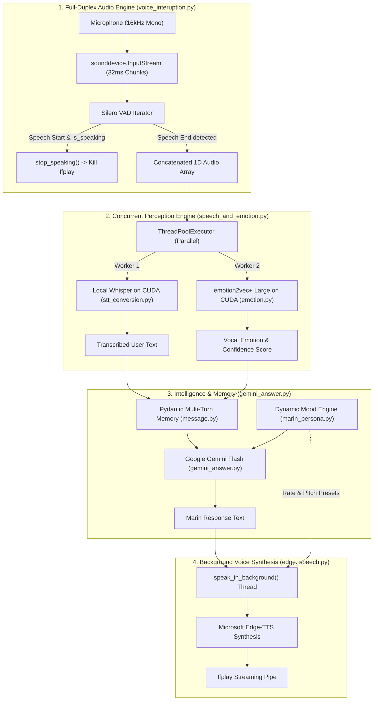

# Marin (v1.0)

An interactive, full-duplex, voice-first AI companion built entirely in Python.

---

**Marin** is a real-time, voice-first AI companion designed for natural, spontaneous spoken conversations. Built from the ground up in pure Python, Marin pairs local speech perception with cloud conversational intelligence and expressive text-to-speech.

Unlike traditional virtual assistants or turn-based chatbots, Marin features **hands-free turn-taking with real-time barge-in interruption**: you never need to touch the keyboard, and you can speak over her mid-sentence to cut her off at any time.

Backed by local **Silero VAD**, NVIDIA CUDA-accelerated **Whisper STT**, FunASR **`emotion2vec`**, Google's **Gemini models**, and Microsoft **Edge-TTS**, Marin perceives not just *what* you say, but *how* you sound—adapting her mood, reactions, pitch, and speech cadence accordingly.

---

## Key Features in Version 1.0

### 1. Hands-Free Conversational Turn-Taking (Silero VAD)
- **Zero Keyboard Interaction**: Employs deep-learning Voice Activity Detection via **Silero VAD** to continuously monitor microphone input at 16,000 Hz.
- **Smart Silence Detection**: Automatically detects when you begin speaking and when you finish your thought (with a tuned ~450ms silence threshold).
- **Rolling Pre-Roll Memory**: Keeps a circular ~300ms audio buffer so opening consonants and words are never clipped or lost before VAD triggers.

### 2. Real-Time Barge-In (Voice Interruptions)
- **Sub-50ms Speech Cutoff**: Marin's voice synthesis and playback run in a managed background thread.
- **Instant Interruption**: The moment your voice triggers the VAD during playback, Marin's `ffplay` audio process is killed immediately, allowing you to cut her off naturally just like talking to a real human.

### 3. Concurrent Perception Engine
- **Parallel Dual Processing**: Dispatches recorded audio simultaneously to both **Speech-to-Text** and **Speech Emotion Recognition** using a managed `ThreadPoolExecutor`.
- **Local Whisper Transcription**: Transcribes spoken audio locally using Hugging Face `transformers` (`openai/whisper-small.en`) on NVIDIA CUDA for zero third-party STT latency.
- **Vocal Tone & Emotion Analysis**: Evaluates pitch, tone, energy, and speech rate using FunASR's foundation model `emotion2vec_plus_large` on CUDA, classifying vocal emotions (neutral, happy, sad, angry, surprised, fearful, disgusted) with confidence scores.

### 4. Dynamic Persona & Mood Engine
- **8 Mood Archetypes**: Each call randomly rolls a distinct persona state (*clingy, drained, hyper, grumpy, mischievous, distracted, soft, restless*).
- **Vocal Tone Perception**: Listens and reacts directly to the boyfriend's vocal tone (softens when sad or drained, matches energy when excited, teases when irritated).
- **Time-of-Day Realism**: Adapts dialogue to current local time (morning, afternoon, evening, late night).
- **Speech-Optimized Texturing**: Eliminates robotic text markers and emoticons in favor of natural conversational speech patterns.

### 5. Sentence-Pipelined Expressive TTS
- **Sentence-Buffered Playback**: Microsoft Edge TTS (`en-US-AvaMultilingualNeural`) with sentence pipelining for low time-to-first-audio.
- **Mood-Matched Vocal Modulation**: Dynamically adjusts speech rate and vocal pitch based on Marin's active mood preset (e.g. +14% rate / +14Hz pitch when hyper, -8% rate / -4Hz pitch when drained).
- **Natural Voice Exit**: Built-in voice commands (`"bye"`, `"quit"`, `"exit"`) allow you to end the call naturally.

---

## Architecture Flowchart



---

## File Structure

```
marin/
├── pyproject.toml                     # Project dependencies & CUDA PyTorch sources (uv)
├── uv.lock                            # Deterministic dependency lockfile
├── .env                               # Environment configuration (GEMINI_API_KEY)
├── README.md                          # Project documentation
├── src/
│   ├── app.py                         # Main full-duplex conversational voice loop
│   ├── interuption/
│   │   └── voice_interuption.py       # Silero VAD hands-free capture & barge-in interruption
│   ├── speech_and_emotion/
│   │   └── speech_and_emotion.py      # Concurrent dispatcher for STT & emotion2vec
│   ├── speech_recognition/
│   │   ├── emotion.py                 # FunASR emotion2vec_plus_large on CUDA
│   │   ├── get_speech.py              # Legacy / direct microphone audio capture utilities
│   │   └── speech_emotion_detect.py   # Standalone emotion testing script
│   ├── speech_to_text/
│   │   └── stt_conversion.py          # Hugging Face Whisper-Small STT on CUDA
│   ├── llm/
│   │   ├── gemini_answer.py           # Google Gemini conversational client with vocal tone injection
│   │   ├── marin_persona.py           # Dynamic mood presets, tone awareness & system prompts
│   │   └── llm_prompt.py              # Legacy persona prompt reference
│   ├── text_to_speech/
│   │   └── edge_speech.py             # Sentence-pipelined Edge-TTS with kill-switch interruption
│   └── validation/
│       └── message.py                 # Pydantic Message schema with emotion metadata
```

---

## Prerequisites

1. **Python `3.12`** installed.
2. **[uv](https://docs.astral.sh/uv/)** package manager installed:
   ```powershell
   powershell -ExecutionPolicy ByPass -c "irm https://astral.sh/uv/install.ps1 | iex"
   ```
3. **NVIDIA GPU with CUDA support** (e.g. RTX 30/40 series) with updated NVIDIA drivers.
4. **[FFmpeg](https://ffmpeg.org/)** (for `ffplay`, used for audio playback):
   - Ensure `ffplay` is accessible in your system `PATH`.
5. **Google Gemini API Key** from [Google AI Studio](https://aistudio.google.com/).

---

## Environment Setup

Create a `.env` file in the project root directory:

```env
GEMINI_API_KEY="your-gemini-api-key-here"
```

---

## Installation & Running

### 1. Synchronize Dependencies
Sync all project dependencies, PyTorch CUDA wheels, and models with `uv`:

```bash
uv sync
```

### 2. Launch Marin
Run the main conversational voice loop:

```bash
uv run python src/app.py
```

### 3. How to Interact
- **Hands-Free**: Speak into your microphone—Marin automatically detects when you speak and when you pause. No Enter key or button presses required.
- **Barge-In / Interruptions**: If Marin is talking and you want to stop her or change the subject, simply speak over her. She will instantly cut off and listen to your new question.
- **Voice Exit**: Say `"bye"`, `"quit"`, or `"exit"` at any time to cleanly conclude the session.
