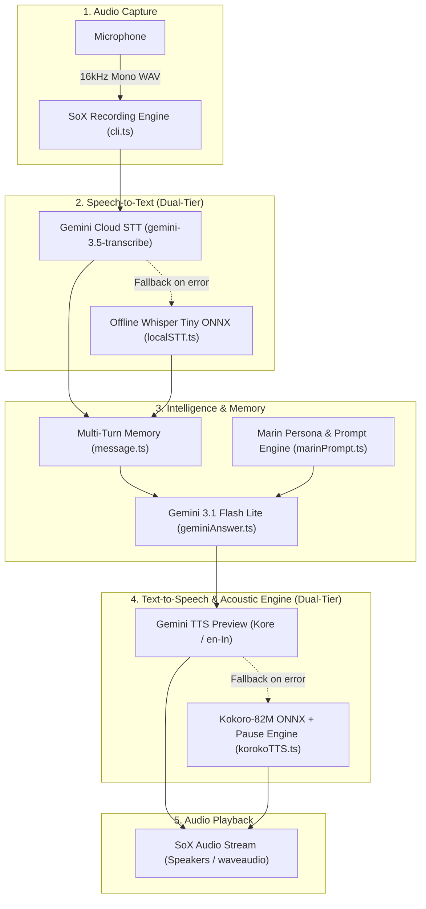

# Marin

An AI girlfriend.

Currently in development...

---

**Marin** is an interactive, voice-first AI girlfriend designed for natural, real-time spoken conversations. Unlike traditional virtual assistants or rigid chatbots, Marin is built to converse like a real companion—delivering spontaneous reactions, playful banter, genuine emotional nuance, and human-like conversational cadence directly through your microphone and speakers.

Backed by a resilient dual-tier architecture, Marin pairs Google's Gemini models with offline local fallbacks, featuring an acoustic micro-pause engine and multi-turn context memory to make every conversation feel continuous, intimate, and alive.

---

## Features

### 1. CLI Voice Pipeline (End-to-End Voice Companion)

A complete local and cloud-powered voice pipeline that captures speech from your microphone, transcribes it, queries Gemini for intelligent, emotionally rich conversational responses, and speaks the answer out loud through your speakers.

#### Pipeline Architecture

1. **Microphone Recording (`src/cli.ts`)**:
   - Uses SoX (`sox` / `sox.exe`) with cross-platform OS detection (native Windows `waveaudio` support).
   - Records 16-bit 16,000 Hz mono WAV audio directly from the microphone until the user presses `Enter`.
   - Protects against empty recordings or silence with friendly audio guard prompts.

2. **Speech-to-Text (`src/geminiSTT.ts` & `src/localSTT.ts`)**:
   - **Primary (Cloud)**: Streams the audio buffer to Google Gemini (`gemini-3.5-transcribe`) with an explicit English language constraint (`languageCodes: ["en"]`).
   - **Fallback (Local / Offline)**: If Gemini STT is unreachable, seamlessly falls back to an offline Whisper Tiny model (`onnx-community/whisper-tiny.en` via `@huggingface/transformers`), converting 16-bit PCM bytes to normalized Float32 audio locally without API keys or internet access.

3. **Conversational Intelligence & Girlfriend Persona (`src/geminiAnswer.ts` & `src/marinPrompt.ts`)**:
   - Prompts Google Gemini (`gemini-3.1-flash-lite`) configured with Marin's girlfriend persona system prompt.
   - **Multi-Turn Context Memory (`src/message.ts`)**: Retains ongoing conversation history (`msgHistory`) across turns, allowing Marin to remember context, previous topics, jokes, and reactions throughout your session.
   - **Voice Exit Commands**: Built-in voice commands (`"bye"`, `"quit"`) allow you to end the call naturally.

4. **Text-to-Speech & Acoustic Engine (`src/geminiTTS.ts` & `src/korokoTTS.ts`)**:
   - **Primary (Cloud TTS)**: Gemini Text-to-Speech preview (`gemini-3.1-flash-tts-preview`) using the Interactions API with a natural female Indian-English voice (`Kore`, `en-In`).
   - **Fallback & Pause Engine (Local Kokoro TTS)**: High-quality offline neural TTS powered by `kokoro-js` (Kokoro-82M ONNX model, `af_heart` voice).
   - **Acoustic Pause Handling**: `korokoTTS.ts` features a custom speech parser (`parseSpeech`) that splits text into speech segments and pause markers (`[pause:ms]`), introducing asynchronous pauses (`sleep(ms)`) between spoken audio chunks for human-like speech delivery.
   - **Direct Speaker Playback**: Pipes 24,000 Hz raw audio directly to system speakers via SoX without writing temporary files to disk.



---

### 2. Browser Speech-to-Text (STT)

A TypeScript speech-to-text implementation using the browser's native Web Speech API (`SpeechRecognition`). 

No UI, no buttons, no CSS—just pure browser console logs.

#### How It Works

- Uses browser native `SpeechRecognition` / `webkitSpeechRecognition`.
- Continuous listening (`recognition.continuous = true`).
- Live **interim** transcripts and locked-in **final** transcripts logged directly to the browser console and sent to `/generate-audio`.

#### Usage

1. Start the local server:
   ```bash
   bun run server.ts
   ```
2. Open `http://localhost:3000` (or `index.html`) in a supported browser (Chrome, Edge).
3. Open the browser developer console (`F12`) to view live logs.
4. Allow microphone access and start speaking.

---

## File Structure

```
marin/
├── src/
│   ├── marinPrompt.ts   # System prompt defining Marin's personality, girlfriend dynamic & speech rules
│   ├── message.ts       # Multi-turn conversation history state management
│   ├── main.ts          # Main continuous CLI conversational voice loop
│   ├── cli.ts           # SoX-based microphone recording (16kHz mono WAV)
│   ├── geminiAnswer.ts  # Gemini 3.1 Flash Lite response generator
│   ├── geminiSTT.ts     # Primary Cloud STT via Gemini 3.5 Transcribe
│   ├── geminiTTS.ts     # Primary Cloud TTS via Gemini Flash TTS (Kore voice)
│   ├── korokoTTS.ts     # Local Kokoro-82M ONNX TTS with [pause:ms] pause parser
│   └── localSTT.ts      # Offline fallback STT via ONNX Whisper Tiny
├── index.html           # Browser Web Speech API interface prototype
├── server.ts            # Bun HTTP server for the browser prototype
├── package.json         # Project metadata and dependencies
└── tsconfig.json        # TypeScript configuration
```

---

## Prerequisites

- [Bun](https://bun.sh/) runtime installed.
- [SoX (Sound eXchange)](https://sourceforge.net/projects/sox/) installed and available in your system `PATH`:
  - **Windows**: Download SoX and ensure `sox.exe` is in your environment `PATH`.
  - **macOS**: `brew install sox`
  - **Linux**: `sudo apt-get install sox libsox-fmt-all`
- A Google Gemini API Key.

---

## Environment Setup

Create a `.env` file in the root directory:

```env
GEMINI_API_KEY="your-gemini-api-key"
GEMIMI_STT_API_KEY="your-gemini-stt-api-key"
GEMIMI_TTS_API_KEY="your-gemini-tts-api-key"
```

*(Note: You can use the same Gemini API key for all three variables if appropriate.)*

---

## Running the CLI Pipeline

Start your conversation with Marin:

```bash
bun run src/main.ts
```

1. The terminal displays `Recording... press Enter to stop`.
2. Speak your message into your microphone.
3. Press `Enter` on your keyboard.
4. View the real-time transcript and Marin's answer on your screen while she speaks back to you through your speakers.
5. Say `"bye"` or `"quit"` anytime to end the conversation.
