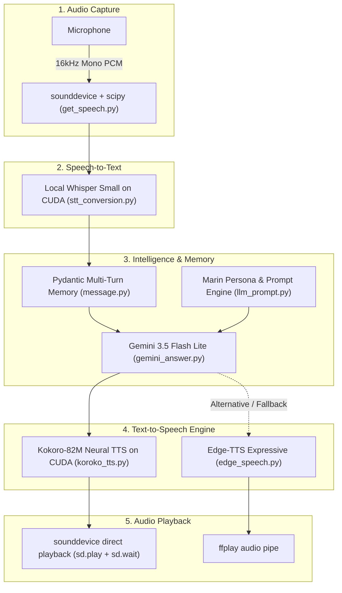
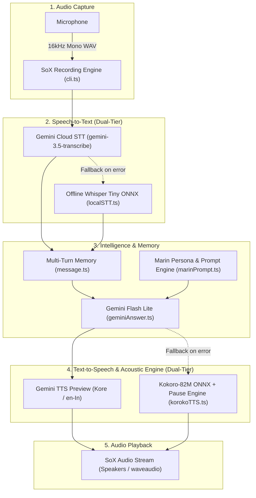

# Marin

An AI girlfriend.

Currently in development...

---

**Marin** is an interactive, voice-first AI girlfriend designed for natural, real-time spoken conversations. Unlike traditional virtual assistants or rigid chatbots, Marin is built to converse like a real companion—delivering spontaneous reactions, playful banter, genuine emotional nuance, and human-like conversational cadence directly through your microphone and speakers.

Backed by a resilient dual-engine architecture across both Python and TypeScript, Marin pairs Google's Gemini models with CUDA-accelerated local speech models (Whisper STT, Kokoro-82M TTS) and streaming cloud engines (Edge-TTS), featuring multi-turn context memory to make every conversation feel continuous, intimate, and alive.

---

## Features

### 1. Python CLI Voice Pipeline (Native CUDA & High Performance)

An end-to-end, high-performance voice companion pipeline in Python powered by `uv` and PyTorch with CUDA 12.6 acceleration. It captures speech from your microphone, transcribes it locally using Whisper, queries Google Gemini for emotionally nuanced conversational responses, and synthesizes expressive speech back to you.

#### Pipeline Architecture

1. **Microphone Recording (`src/speech_recognition/get_speech.py`)**:
   - Uses `sounddevice` and `scipy.io.wavfile` to capture 16,000 Hz mono PCM audio directly from your microphone.
   - Starts recording on launch and trims audio automatically when the user presses `Enter`.
   - Protects against empty audio buffers and slices exact frame counts without temporary file overhead.

2. **Speech-to-Text (`src/speech_to_text/stt_conversion.py`)**:
   - High-accuracy local speech transcription powered by Hugging Face `transformers` pipeline (`openai/whisper-small.en`).
   - Runs directly on GPU with CUDA acceleration (`device="cuda"`), completely offline without third-party STT fees or latency.

3. **Conversational Intelligence & Girlfriend Persona (`src/llm/gemini_answer.py` & `src/llm/llm_prompt.py`)**:
   - Prompts Google Gemini (`gemini-3.5-flash-lite`) configured with Marin's girlfriend persona system prompt.
   - **Multi-Turn Context Memory (`src/validation/message.py`)**: Strict Pydantic-validated `Message` model (`role: "user" | "model"`) that preserves continuous chat history across turns.
   - **Voice Exit Commands**: Built-in voice commands (`"bye"`, `"quit"`, `"exit"`) allow you to end the call naturally.

4. **Text-to-Speech & Acoustic Playback (`src/text_to_speech/`)**:
   - **Local Kokoro-82M TTS (`src/text_to_speech/koroko_tts.py`)**: High-fidelity neural TTS powered by `kokoro` (`KPipeline` on CUDA). Generates warm, human-like voice synthesis with natural breaths and cadence (`af_heart`, `hf_alpha`, `bf_emma`).
   - **Real-Time Direct Playback**: Streams audio chunks sentence-by-sentence directly to speakers via `sounddevice` (`sd.play` with `sd.wait()`) with zero disk I/O.
   - **Cloud Streaming Fallback (`src/text_to_speech/edge_speech.py`)**: Asynchronous Microsoft Edge TTS (`edge-tts`) with expressive voices (`en-IN-NeerjaExpressiveNeural`, `en-US-AvaNeural`), streamed through an `ffplay` pipe.



---

### 2. TypeScript / Bun CLI Voice Pipeline

A parallel TypeScript implementation featuring dual-tier local and cloud models with an acoustic micro-pause engine.

#### Pipeline Architecture

1. **Microphone Recording (`src/cli.ts`)**:
   - Uses SoX (`sox` / `sox.exe`) with cross-platform OS detection (native Windows `waveaudio` support).
   - Records 16-bit 16,000 Hz mono WAV audio directly from the microphone until the user presses `Enter`.

2. **Speech-to-Text (`src/geminiSTT.ts` & `src/localSTT.ts`)**:
   - **Primary (Cloud)**: Streams the audio buffer to Google Gemini (`gemini-3.5-transcribe`).
   - **Fallback (Local / Offline)**: Offline Whisper Tiny model (`onnx-community/whisper-tiny.en` via `@huggingface/transformers`).

3. **Conversational Intelligence (`src/geminiAnswer.ts` & `src/marinPrompt.ts`)**:
   - Prompts Google Gemini (`gemini-3.1-flash-lite` / `gemini-3.5-flash-lite`) with Marin's girlfriend persona and multi-turn context memory (`src/message.ts`).

4. **Text-to-Speech & Acoustic Engine (`src/geminiTTS.ts` & `src/korokoTTS.ts`)**:
   - **Primary (Cloud TTS)**: Gemini Text-to-Speech preview (`gemini-3.1-flash-tts-preview`, `Kore` voice).
   - **Fallback (Local Kokoro ONNX)**: `kokoro-js` with a custom speech parser (`parseSpeech`) supporting asynchronous micro-pauses (`[pause:ms]`).



---

### 3. Browser Speech-to-Text (STT)

A TypeScript speech-to-text implementation using the browser's native Web Speech API (`SpeechRecognition`). 

No UI, no buttons, no CSS—just pure browser console logs.

#### How It Works

- Uses browser native `SpeechRecognition` / `webkitSpeechRecognition`.
- Continuous listening (`recognition.continuous = true`).
- Live **interim** transcripts and locked-in **final** transcripts logged directly to the browser console and sent to `/generate-audio`.

#### Usage

1. Start the local server:
   ```bash
   bun run server.ts
   ```
2. Open `http://localhost:3000` (or `index.html`) in a supported browser (Chrome, Edge).
3. Open the browser developer console (`F12`) to view live logs.
4. Allow microphone access and start speaking.

---

## File Structure

```
marin/
├── pyproject.toml              # Python project configuration (uv, CUDA PyTorch, dependencies)
├── uv.lock                     # Locked Python dependency tree
├── package.json                # TypeScript project metadata and dependencies
├── tsconfig.json               # TypeScript configuration
├── src/
│   ├── app.py                  # Main Python continuous voice conversation loop
│   ├── speech_recognition/
│   │   └── get_speech.py       # sounddevice microphone capture & PCM trimming
│   ├── speech_to_text/
│   │   └── stt_conversion.py   # Hugging Face Whisper-Small STT on CUDA
│   ├── llm/
│   │   ├── gemini_answer.py    # Google GenAI Gemini conversational engine
│   │   └── llm_prompt.py       # Comprehensive Marin persona & voice dynamic prompt
│   ├── text_to_speech/
│   │   ├── koroko_tts.py       # High-fidelity Kokoro-82M neural TTS on CUDA
│   │   └── edge_speech.py      # Cloud streaming Microsoft Edge-TTS with ffplay
│   ├── validation/
│   │   └── message.py          # Pydantic Message schema and msgHistory state
│   ├── main.ts                 # TypeScript continuous CLI conversational voice loop
│   ├── cli.ts                  # SoX-based microphone recording (16kHz mono WAV)
│   ├── geminiAnswer.ts         # TypeScript Gemini response generator
│   ├── geminiSTT.ts            # Primary Cloud STT via Gemini 3.5 Transcribe
│   ├── geminiTTS.ts            # Primary Cloud TTS via Gemini Flash TTS (Kore voice)
│   ├── korokoTTS.ts            # TypeScript Kokoro-82M ONNX TTS with pause parser
│   ├── localSTT.ts             # TypeScript offline fallback STT via ONNX Whisper Tiny
│   ├── marinPrompt.ts          # TypeScript system prompt
│   └── message.ts              # TypeScript conversation history interface
├── index.html                  # Browser Web Speech API interface prototype
└── server.ts                   # Bun HTTP server for the browser prototype
```

---

## Prerequisites

### For Python Pipeline (Recommended):
- Python `3.12` installed.
- [uv](https://docs.astral.sh/uv/) package manager installed:
  ```powershell
  powershell -ExecutionPolicy ByPass -c "irm https://astral.sh/uv/install.ps1 | iex"
  ```
- An NVIDIA GPU with CUDA support (e.g. RTX 30/40 series) with CUDA 12.4+ drivers.
- [FFmpeg](https://ffmpeg.org/) (for `ffplay`, if using the Edge-TTS fallback):
  - Ensure `ffplay` is available in your system `PATH`.

### For TypeScript Pipeline:
- [Bun](https://bun.sh/) runtime installed.
- [SoX (Sound eXchange)](https://sourceforge.net/projects/sox/) installed and available in your system `PATH`:
  - **Windows**: Download SoX and ensure `sox.exe` is in your environment `PATH`.
  - **macOS**: `brew install sox`
  - **Linux**: `sudo apt-get install sox libsox-fmt-all`

### General:
- A Google Gemini API Key from [Google AI Studio](https://aistudio.google.com/).

---

## Environment Setup

Create a `.env` file in the root directory:

```env
GEMINI_API_KEY="your-gemini-api-key"
```

*(Note: For the TypeScript pipeline, you can also set `GEMIMI_STT_API_KEY` and `GEMIMI_TTS_API_KEY` if using separate keys).*

---

## Running the CLI Pipeline

### 1. Run the Python Pipeline (Fastest, Local CUDA)

Install dependencies and start your conversation with Marin:

```bash
# Sync dependencies and CUDA PyTorch wheels
uv sync

# Launch the voice loop
uv run python src/app.py
```

1. The terminal displays `Say something.... say 'quit' 'bye' or 'exit' to stop`.
2. Speak your message into your microphone and press `Enter`.
3. Whisper transcribes your voice on GPU.
4. Gemini generates Marin's conversational response.
5. Kokoro-82M synthesizes natural speech directly to your speakers with human-like cadence.
6. Say `"bye"`, `"quit"`, or `"exit"` anytime to end the conversation.

### 2. Run the TypeScript Pipeline

```bash
bun install
bun run src/main.ts
```
